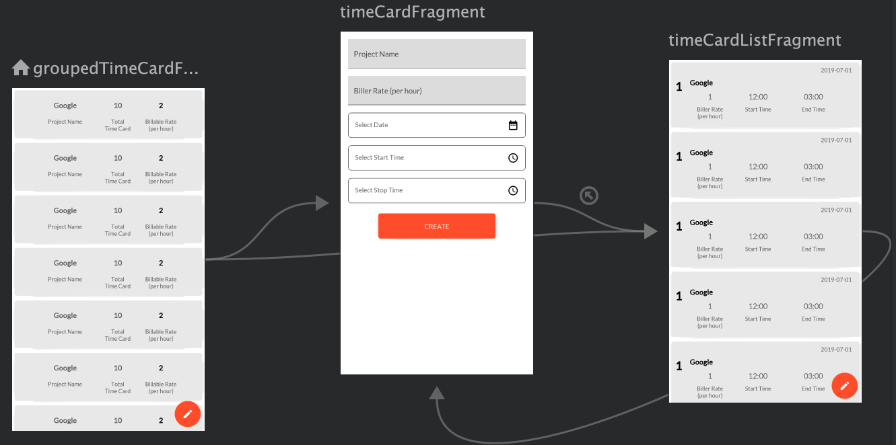

# Billable Hour

A firm uses a billable rate system. Every lawyer, depending on their grade has a billable rate and for any project they work on, they must send in the total number of hours they’ve worked on so that the finance team can create invoices for clients to pay.

# Android Studio IDE setup 

Billable hour requires Android Studio version 3.4 or higher

# Concepts Used 
* Navigation 
* MVVM Architecture
* Dependency Injection using Kodein
* Data Persistence using Room
* Data Binding 
* Continuous Integration using CircleCI

# User Interaction 
